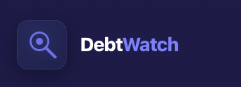
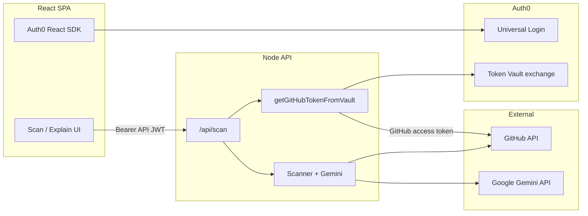

# DebtWatch

  

**Why:** Onboarding and security review don’t scale when teams rely only on long READMEs and noisy manual triage.

**What:** DebtWatch is a GitHub-focused copilot: **scan** repos for secrets and vulnerability-shaped patterns (with an LLM second pass), and **explain** repos with AI summaries plus optional infographic visuals. Sign-in uses **Auth0**; GitHub access uses **Auth0 Token Vault** (server-side token exchange).

---

## App workflow

1. Open the app and sign in with Auth0 (Google or GitHub).
2. Enter a GitHub `owner/repo` or URL and an optional prompt.
3. **Scan:** tree walk → pattern findings → Gemini labels **REAL** vs **FALSE_POSITIVE**.
4. **Explain:** README + metadata → parallel Markdown summary and optional Gemini image stream.
5. **Analytics / history:** trends and past scans stored in the browser.

---

## Architecture

---

## Walkthrough

1. Sign in

2. Scan a repository

3. Explain — summary

4. Explain — visualization

5. Analytics

6. History

---

## Tech stack

| Layer | Stack |
|-------|--------|
| Frontend | React 19, Vite, Tailwind CSS 4, Radix Themes, Auth0 SPA SDK, Axios, react-markdown, remark-gfm, Mermaid |
| Backend | Node 20+, Express 5, TypeScript, Octokit, `@google/genai`, Auth0 JWT + Token Vault |
| Auth | Auth0 (Google + GitHub), API audience JWT |

---

## Agents and models

| Agent / stage | Role | Default model / notes |
|----------------|------|------------------------|
| Ingestion | Repo resolution, tree, blobs | `scanner.ts`, Octokit |
| Pattern hunter | Secrets + vuln-shaped regex | `scanner.ts` |
| Devil’s Advocate | REAL / FALSE_POSITIVE | `gemini-3.1-pro-preview` (`GEMINI_REASONING_MODEL`) |
| Explainer (text) | Markdown overview | same as reasoning |
| Explainer (visual) | Infographic stream | `gemini-3.1-flash-image-preview` (`GEMINI_IMAGE_MODEL`) |

Server: `GEMINI_API_KEY`, optional `GEMINI_REASONING_MODEL`, `GEMINI_IMAGE_MODEL`.

---

## Prerequisites

- Node.js **20+**
- Auth0: SPA app, API (audience), GitHub (and optional Google) connections, Token Vault for GitHub
- Google **Gemini** API key (backend)

**Backend:** `cd backend && npm install && npm run dev` — configure `.env` from `backend/.env.example`.

**Frontend:** `cd frontend && npm install && npm run dev` — configure `.env.local` from `frontend/.env.example`.

---

## Developer

**Amrutha Junnuri**  
Email: [amrutha.junnuri98@gmail.com](mailto:amrutha.junnuri98@gmail.com)

---

## License

MIT License

Copyright (c) 2026 Amrutha Junnuri

