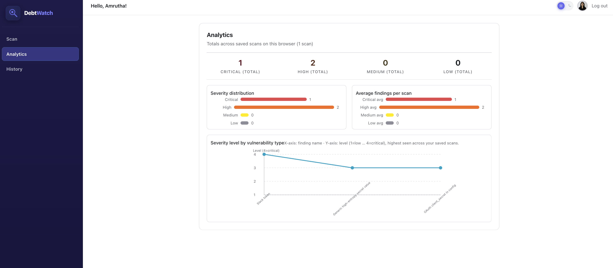
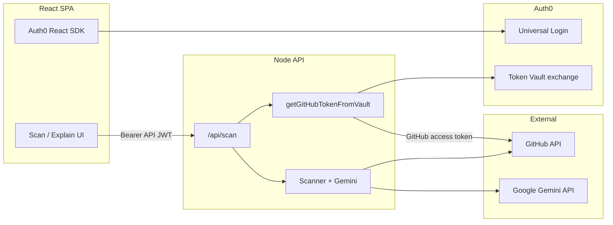

# DebtWatch

<p align="center">
  
</p>

## Authorized to Act: Auth0 for AI Agents

**DebtWatch is an agentic security and onboarding copilot for GitHub.** It is built for the *Authorized to Act* hackathon: we use **Auth0 for AI Agents — Token Vault** so users sign in with **Google or GitHub**, and **provider tokens never live in our frontend or ad‑hoc storage**. The backend exchanges the caller’s **Auth0 API access token** for a **GitHub access token via Token Vault**, then our **AI agents** read repository metadata and source **with user consent and least privilege** (read‑only GitHub API). That is the same identity pattern humans use for OAuth—now **your scanning and explanation agents are authorized to act on behalf of the signed‑in user**, without you re‑implementing token refresh or consent.

> **Security & trust (read this first for judges)**  
> **Google and GitHub OAuth tokens are issued and managed by Auth0.** End users authenticate through Auth0 Universal Login; connection tokens are available to this app through **Auth0 Token Vault** (access token exchange), not by embedding secrets in the client. **This application is protected by Auth0** (SPA + API audience + optional Resource Owner Password–style flows are *not* used for Vault exchange—the SPA sends a **Bearer JWT** to the API, which performs the **subject token → GitHub token** exchange server‑side). Your repo stays **yours**: we do not store GitHub PATs in the database; we use the vault per request when configured.

---

## The problem

1. **Onboarding friction** — New developers struggle to see the *whole* repository at once: architecture, main modules, and how pieces connect. READMEs help, but they are long and not always visual.
2. **Manual security toil** — Hunting **exposed credentials**, risky patterns, and noisy static findings by hand does not scale. Teams need **triage**, not another thousand raw alerts.

**DebtWatch** addresses both: **explain** mode gives **AI‑grounded summaries** plus optional **infographic‑style visuals**, while **scan** mode walks the tree, flags **secrets and vulnerability‑shaped patterns**, and runs a **second‑opinion AI pass** to drop false positives.

---

## What DebtWatch does

| Capability | Description |
|------------|-------------|
| **Sign‑in** | Auth0 — **GitHub** and **Google** (tokens managed by Auth0 / Vault as above). |
| **Scan** | Clone of intent: walk **public (or token‑accessible) GitHub repos**, pattern‑match risky strings and categories, then **Gemini** “Devil’s Advocate” to mark **REAL** vs **FALSE_POSITIVE**. |
| **Explain** | Natural‑language **overview** (Markdown) from README + repo metadata, plus parallel **image + text** generation for a **visual explainer** (default: `gemini-3.1-flash-image-preview`). |
| **Analytics / History** | Client‑side **scan history** for trends (severity counts, charts) — local to the browser. |

---

## Screenshots *(from `frontend/src/assets`)*

### Login — Auth0‑protected entry


### Scan — repository URL, optional prompt, vulnerability‑style scan


### Explain — AI summary (Markdown, Mermaid‑friendly)


### Explain — visual infographic (Gemini image preview)


### Analytics — aggregates from saved scans



### History — recent scans


---

## Architecture (high level)



---

## App workflow (user journey)

1. User opens the app → **Auth0** login (**GitHub** or **Google**).
2. User enters **owner/repo** or **GitHub URL** and optional **prompt**.
3. **Scan path** (default when the prompt is not “explain‑like”):  
   Backend resolves **GitHub token** (Token Vault if JWT present, else optional env `GITHUB_TOKEN` / anonymous).  
   **Tree walk** → file blobs → **regex findings** → **Devil’s Advocate** (Gemini) returns only **REAL** items.
4. **Explain path** (e.g. “explain this repo”, “visualize”, “overview”):  
   Fetch **README + metadata** → **Gemini reasoning** (Markdown) **in parallel** with **Gemini flash image** stream (infographic + optional tools).  
   UI shows **image** (if returned) + **rendered Markdown** (incl. Mermaid blocks).

---

## “Agents” and models *(hackathon story)*

DebtWatch is **multi‑stage agentic**: deterministic agents prepare context; **LLM agents** reason and generate.

| Stage / “agent” | Role | Implementation |
|-----------------|------|------------------|
| **Ingestion** | Resolve repo, default branch, recursive tree, fetch text blobs (size‑capped). | `scanner.ts` + Octokit |
| **Pattern hunter** | Detect secrets (Slack, GH PAT, AWS, …) and vuln‑shaped code patterns + auth‑related TODOs. | Regex catalogs in `scanner.ts` |
| **Devil’s Advocate** | Second opinion: label each finding **REAL** or **FALSE_POSITIVE** with short reason; filter noise. | **Gemini** `geminiReasoningText` — default **`gemini-3.1-pro-preview`** (`GEMINI_REASONING_MODEL`) |
| **Explainer (text)** | Structured Markdown: overview, parts, security angle, next steps. | Same reasoning model |
| **Explainer (visual)** | One infographic, 16:9, 1K, optional Google Search tool; streamed **TEXT + IMAGE**. | **`gemini-3.1-flash-image-preview`** (`GEMINI_IMAGE_MODEL`) via `geminiRepoInfographicStream` |

Environment overrides: `GEMINI_REASONING_MODEL`, `GEMINI_IMAGE_MODEL`, `GEMINI_API_KEY` on the server.

---

## Tech stack

| Layer | Choices |
|-------|---------|
| **Frontend** | React 19, Vite, Radix Themes, Auth0 SPA SDK, Axios, react-markdown + remark-gfm + Mermaid |
| **Backend** | Express 5, TypeScript, Octokit, **@google/genai**, Auth0 Token Vault exchange (`tokenVault.ts`) |
| **Auth** | Auth0 (Google + GitHub connections), API audience JWT to backend |

---

## Repository layout

```
debtwatch/
├── frontend/          # Vite + React SPA
│   └── src/assets/    # Screenshots & logo (PNG) referenced in this README
├── backend/           # Express API, scanner, Gemini, Token Vault
└── README.md
```

---

## Local setup

### Prerequisites

- Node.js 20+ recommended  
- Auth0 tenant with **SPA app**, **API** (audience), **GitHub** (and optionally **Google**) social connections, **Token Vault** enabled for GitHub per Auth0 docs  
- Google **Gemini API key** for AI features  

### Backend

```bash
cd backend
cp .env.example .env   # if present; else create .env from your secrets
# Set at minimum: GEMINI_API_KEY, AUTH0_*, and optionally GITHUB_TOKEN for dev without Vault
npm install
npm run dev
```

### Frontend

```bash
cd frontend
cp .env.example .env.local   # see comments inside for VITE_AUTH0_* and VITE_API_URL
npm install
npm run dev
```

Open the URL Vite prints (default `http://localhost:5173`). Ensure **Allowed Callback / Logout / Web Origins** in Auth0 match your dev origin.

---

## Deploying (Vercel + API) — hackathon‑safe process

### Start here: GitHub, Render, and Vercel

**Do I have to push my code to GitHub?**

**Yes, if you want to use Vercel and Render the way this project is set up.** Both products **clone your repository from the internet** and run install/build on their servers. They cannot see files that exist only on your laptop.

**Are there other options?** You could host the API elsewhere (your own VPS, Railway with GitLab, etc.) or upload builds manually — but the **documented path** is: **GitHub → Render (API) + Vercel (frontend)**.

---

#### 1) GitHub — do this before Render or Vercel

##### Do I create the repo on GitHub *before* I push code?

**Yes. Always create the empty repository on GitHub’s website first**, then connect your laptop to it and push.  
If you run `git push` before a repo exists on GitHub, **there is nowhere for the code to go**.

**Order (memorize this):**

1. **Browser:** Create the GitHub repository (next subsection).
2. **Laptop:** `git init` (if needed) → commit → add `remote` → `git push`.

---

##### One GitHub repo or two?

| Layout | What it means | What **this** codebase looks like |
|--------|----------------|-----------------------------------|
| **One repo (recommended)** | **One** GitHub repository contains **both** `frontend/` and `backend/` folders at the top level. | **This is how the project is already structured.** You push the whole project once. **Render** and **Vercel** each connect to **the same** GitHub repo; you only change **Root Directory** (`backend` on Render, `frontend` on Vercel). |
| **Two repos** | **Repo A** = only backend. **Repo B** = only frontend. | The repo **does not** come pre-split. You would **manually** make two new repos and copy/move files so each repo’s **root** is either the backend app or the frontend app (each with its own `package.json` at the top). Then Render connects to **Repo A**, Vercel to **Repo B**. **No** Root Directory subfolder—because there is no monorepo. |

**If you are unsure, use one repo.** Less copying, fewer mistakes, and it matches this README and `render.yaml`.

---

##### Create the GitHub repository (browser — step by step)

1. Log in to [https://github.com](https://github.com).
2. Click the **+** (top right) → **New repository**.
3. **Repository name:** e.g. `debtwatch` (any name is fine).
4. Choose **Public** or **Private**.
5. **Important for first push:**  
   - Either leave **Add a README** **unchecked** (empty repo — simplest), **or**  
   - If you check **Add a README**, GitHub creates a first commit. Then your first `git push` may be rejected until you **pull and merge** (GitHub will show commands). Beginners: **empty repo = no README** is easiest.
6. Click **Create repository**.
7. GitHub shows a page with a URL like `https://github.com/YOUR_USERNAME/debtwatch.git`. **Copy that URL.** You will paste it into `git remote add origin` below.

---

##### One repo: push your local project (terminal — step by step)

Your local folder should look like: `debtwatch/frontend/...` and `debtwatch/backend/...` (both folders exist).

1. Open Terminal.
2. Go to the folder that **contains** both `frontend` and `backend`:

```bash
cd /path/to/debtwatch
```

(Replace `/path/to/debtwatch` with your real path, e.g. `cd ~/Documents/Projects/debtwatch`.)

3. Check you are not about to commit secrets:

```bash
git status
```

- If **`backend/.env`** or **`frontend/.env.local`** appear under **staged** or **tracked** files, **do not commit them**. They should be listed in `.gitignore` and **untracked**. If they are tracked, stop and fix that before pushing (e.g. `git rm --cached` on those files) so secrets never go to GitHub.

4. If Git says **“not a git repository”**, initialize and make the first commit:

```bash
git init
git add .
git commit -m "Initial commit"
```

5. Link this folder to the **empty** repo you created on GitHub (use **your** copied URL):

```bash
git remote add origin https://github.com/YOUR_USERNAME/debtwatch.git
git branch -M main
git push -u origin main
```

6. Refresh GitHub in the browser — you should see `frontend`, `backend`, `README.md`, etc.

**Later:** When you use Render and Vercel, you authorize **the same GitHub account** and select **this same repository** twice (once per product). **Render** uses **Root Directory `backend`**. **Vercel** uses **Root Directory `frontend`**.

---

##### Two repos (optional — only if you really want to split)

Only do this if you **intentionally** want two GitHub repos.

1. **Repo 1 (API):** On GitHub, create e.g. `debtwatch-api`. On your machine, create a new folder, copy **everything inside** your current `backend/` folder so **`package.json` is at the root** of that folder (not inside another `backend` folder). `git init`, commit, add `origin`, push to `debtwatch-api`.
2. **Repo 2 (web):** On GitHub, create e.g. `debtwatch-web`. Copy **everything inside** your current `frontend/` folder so **`package.json` is at the root**. Same git steps; push to `debtwatch-web`.
3. **Render:** Connect **only** `debtwatch-api`. **Root Directory** = **empty** / `.` (repo root is already the API).
4. **Vercel:** Connect **only** `debtwatch-web`. **Root Directory** = **empty** / `.`
5. **`render.yaml`** in this monorepo **does not apply** to a split layout unless you keep a copy in the API repo—use **manual Web Service** settings on Render for the API repo.

You still set the same **environment variables** on Render and Vercel; only **which GitHub repo** each host pulls from changes.

---

#### 2) Render — what you actually set up (API / backend)

**Goal:** A **Web Service** that runs the Express app in `backend/`.

| Where in Render | What to choose |
|-----------------|----------------|
| **New → Blueprint** *(easiest)* | Connect GitHub → select this repo → Render reads [`render.yaml`](render.yaml) and creates the API service. |
| **Or New → Web Service** | Same repo, then set fields manually (below). |

**If you use Web Service manually**, set at least:

| Field | Value |
|-------|--------|
| **Root Directory** | `backend` |
| **Runtime / Environment** | Node |
| **Build Command** | `npm install && npm run build` |
| **Start Command** | `npm start` |

**Environment (Render dashboard → your service → Environment):**

- Open [`backend/.env.example`](backend/.env.example) and create **one Render variable per line** (same names). Minimum to get the app running with Auth0 + Gemini: `GEMINI_API_KEY`, `AUTH0_DOMAIN`, `AUTH0_AUDIENCE`, `AUTH0_CUSTOM_API_CLIENT_ID`, `AUTH0_CUSTOM_API_CLIENT_SECRET` (plus any other keys your local `backend/.env` uses).
- **After Vercel is live**, add **`FRONTEND_URL`** = your Vercel site, e.g. `https://your-app.vercel.app` (no path). Without this, the browser will block API calls (**CORS**).
- Optional: **`CORS_ALLOW_VERCEL=1`** if you use Vercel **preview** URLs (`*.vercel.app`) and do not want to edit Render for every preview.

**Check it worked:** open `https://YOUR-SERVICE.onrender.com/health` — you should see something like `{"status":"ok"}`.

---

#### 3) Vercel — what you actually set up (frontend)

**Goal:** Build the Vite app in `frontend/` and serve it at a `*.vercel.app` URL.

| Step | What to do |
|------|------------|
| Import | [vercel.com](https://vercel.com) → **Add New** → **Project** → **Import** your GitHub repo. |
| **Root Directory** | Set to **`frontend`** (required for this monorepo). |
| Build | Defaults are usually fine (`npm install`, `npm run build`, output `dist`). `frontend/vercel.json` helps Vite detection. |
| **Environment Variables** | Project → **Settings** → **Environment Variables** → scope **Production**. Copy every **`VITE_*`** name from [`frontend/.env.production.example`](frontend/.env.production.example) and paste **real values**. |

**Critical values:**

- **`VITE_API_URL`** = your Render API base URL, e.g. `https://your-api.onrender.com` (**no** trailing slash).
- **`VITE_AUTH0_REDIRECT_URI`** = your final Vercel URL, e.g. `https://your-app.vercel.app` (same origin the user sees in the address bar).

Deploy once, copy the **production** URL from Vercel, then go back to Render and set **`FRONTEND_URL`** to that URL and **redeploy** the API if you had not set it yet.

---

#### 4) Auth0 (after both URLs exist)

In the Auth0 Dashboard → **Applications** → your SPA: add your Vercel URL to **Allowed Callback URLs**, **Allowed Logout URLs**, and **Allowed Web Origins** (exact `https://…` match).

---

#### 5) Reference files in this repo

| File | Purpose |
|------|---------|
| [`render.yaml`](render.yaml) | Render Blueprint for the API (optional if you configure Web Service manually). |
| [`backend/.env.example`](backend/.env.example) | Names of variables to paste into **Render**. |
| [`frontend/.env.production.example`](frontend/.env.production.example) | Names of **`VITE_*`** variables to paste into **Vercel**. |

### Is pushing to GitHub first a good idea?

**Yes — see [Start here: GitHub, Render, and Vercel](#start-here-github-render-and-vercel)** above. Your **`.gitignore`** is meant to keep **`backend/.env`**, **`frontend/.env.local`**, and similar files **out of Git**; never commit secrets.

### Important: you have two apps

| Piece | What it is | Typical hosting |
|-------|------------|-----------------|
| **Frontend** | Vite + React (`frontend/`) | **Vercel** (static + serverless edge) |
| **Backend** | Express API on a **port** (`backend/`) | **Not** a static site — run it on **Render**, **Railway**, **Fly.io**, **Google Cloud Run**, etc. |

Vercel can run serverless functions, but this repo’s API is a **classic Express server**. The straightforward hackathon path is: **Vercel = frontend only**, **one other host = backend** (free tiers exist on Render/Railway).

### Can I put `frontend/` and `backend/` on two different GitHub repos?

**Yes, if you want.** Either layout works:

| Layout | What to do |
|--------|------------|
| **One repo (monorepo)** | Keep `debtwatch/` as today. Vercel **Root Directory** = `frontend`. Backend deploys from the same repo on Render/Railway (root = `backend`, build/start commands as below). |
| **Two repos** | e.g. `debtwatch-web` (only `frontend` contents) and `debtwatch-api` (only `backend` contents). Same deploy rules: Vercel imports **web** repo; Render/Railway imports **api** repo. |

Use **`VITE_API_URL`** on Vercel to point at whatever public URL the API has—repo layout does not matter.

### Can I import **both** frontend and backend as **two Vercel projects**?

**Not in a useful way for this codebase, without extra work.**

- **Frontend → Vercel:** Correct. Vite builds to static files; Vercel serves them.
- **Backend (Express) → second Vercel project:** Vercel is **not** a traditional “Node server on a port” host. A second project would try to **build** your API like a website; Express does not produce a static `dist` folder the way Vite does, so it will **not** “just work” as a second standard Vercel app.

**What actually works:**

1. **Vercel** = **one** project → **frontend only**.  
2. **Backend** = **Render, Railway, Fly.io, Google Cloud Run**, etc. (one **Web Service** that runs `npm run build && npm start` or `node dist/index.js` from `backend/`).

Advanced option: rewrite the API as **Vercel Serverless Functions** (`/api/*.ts`)—that is a **refactor**, not “import the backend folder as-is.”

### Environment variables (nothing “magical” about `.env` files)

Local files are **only for your laptop**. Production uses **the same names**, entered in each host’s dashboard:

**Backend host** (set these in Render/Railway/etc.):

| Variable | Local analogue | Purpose |
|----------|----------------|---------|
| `PORT` | `PORT=3001` | Often **ignored** — platform sets `PORT` automatically. |
| `FRONTEND_URL` | `FRONTEND_URL=http://localhost:5173` | **Production:** `https://your-app.vercel.app` (your real Vercel URL). Used for **CORS** with `index.ts`. |
| `CORS_ALLOW_VERCEL` | `0` or `1` | If `1`, allow any origin on **`*.vercel.app`** (handy for preview URLs). |
| `CORS_ORIGINS` | optional | Comma‑separated extra origins if needed. |
| `GEMINI_API_KEY` | `backend/.env` | Server secret — **never** put in frontend. |
| `AUTH0_DOMAIN`, `AUTH0_*` | `backend/.env` | Token Vault / API exchange secrets. |
| `GITHUB_TOKEN` / `GH_TOKEN` | optional dev fallback | Optional in prod if everyone uses Vault. |

**Vercel** (Project → Settings → Environment Variables) — **must** be available at **build** time for `VITE_*`:

| Variable | Local analogue | Purpose |
|----------|----------------|---------|
| `VITE_API_URL` | `VITE_API_URL=http://localhost:3001` | **Production:** `https://your-api.onrender.com` (or whatever your API URL is). |
| `VITE_AUTH0_DOMAIN` | `.env.development` / `.env.local` | Your Auth0 domain. |
| `VITE_AUTH0_CLIENT_ID` | same | SPA client ID. |
| `VITE_AUTH0_AUDIENCE` | same | API identifier. |
| `VITE_AUTH0_REDIRECT_URI` | `http://localhost:5173` | **Production:** `https://your-app.vercel.app` (exact origin, no trailing path unless you use one). |

After the first deploy, copy the **real** Vercel URL into Auth0 and into `FRONTEND_URL` on the backend, then redeploy the backend if needed.

### Auth0 dashboard (do this after you have both URLs)

1. **Applications → your SPA:** add production **Callback URL**, **Logout URL**, **Allowed Web Origins** → `https://….vercel.app`.
2. **APIs:** ensure the SPA is authorized for your API audience.
3. **Token Vault / GitHub connection:** unchanged logic; users still consent via Auth0.

### Vercel project settings

1. **Import** the GitHub repo.
2. **Root Directory:** `frontend` (monorepo).
3. **Build:** `npm run install` (default) + `npm run build` — output `dist` (Vite default).
4. Optional: `frontend/vercel.json` sets `"framework": "vite"` so Vercel detects Vite.

### Order of operations (so you don’t mess up)

1. Confirm **`git status`** does not list `.env` / `.env.local` — if it does, unstage and keep them local only.
2. **Push** clean repo to GitHub.
3. **Deploy backend** first → note the public API base URL (`https://…`).
4. **Create Vercel project** from repo, root `frontend`, set **`VITE_*`** including `VITE_API_URL` = that API URL.
5. **Deploy Vercel** → note `https://….vercel.app`.
6. Set **`FRONTEND_URL`** on the backend to that Vercel URL → **redeploy backend** (CORS).
7. **Update Auth0** callback / logout / web origins for the Vercel URL.
8. Smoke test: login, scan, explain.

---

## Hackathon alignment (*Authorized to Act*)

- **Requirement:** Use **Token Vault** from **Auth0 for AI Agents**.  
- **DebtWatch:** The scan API uses the **subject’s Auth0-issued API JWT** to retrieve a **GitHub access token** from **Token Vault**, so the **agent pipeline** can call **GitHub as the user**—without storing their OAuth refresh material in our codebase.  
- **Pitch:** Same delegation model as “human uses GitHub API with OAuth”—extended to **AI-assisted scan and explain** workflows.

---

## Submission checklist (Devpost‑style)

- [ ] Short **text description** of features (this README + summary).  
- [ ] **Demo video** (~3 min), app running in target environment, public link (YouTube / Vimeo / etc.).  
- [ ] **Public repo** URL with build instructions.  
- [ ] **Published app URL** (or note if not applicable).  
- [ ] Optional **bonus blog** (250+ words, Token Vault angle, clearly marked in submission).

---

## License

See repository license file if present; otherwise treat as project default for hackathon submission.

---

*Built with Auth0 Token Vault, GitHub, and Google Gemini — so developers can **understand** repos faster and **catch** risky exposure **with less noise**.*
